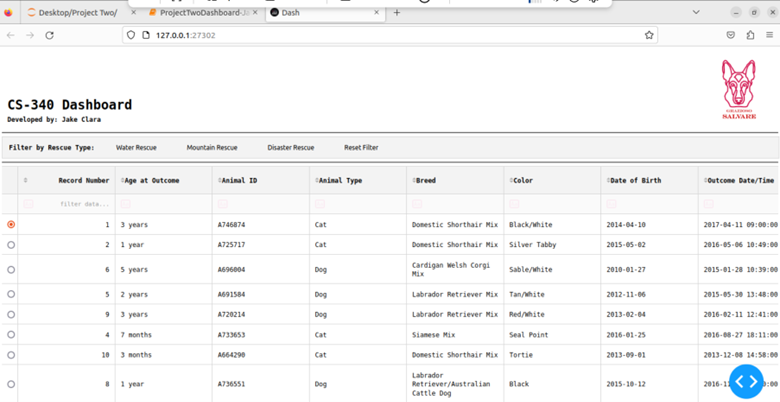
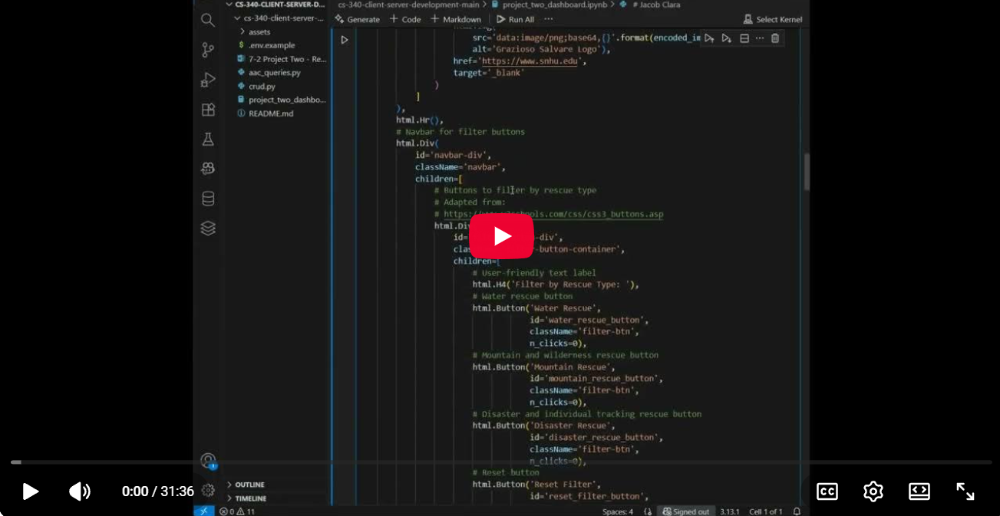
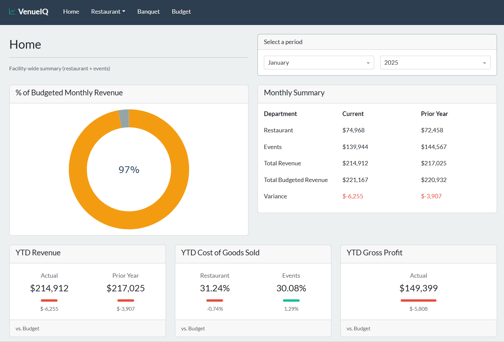

---
# Feel free to add content and custom Front Matter to this file.
# To modify the layout, see https://jekyllrb.com/docs/themes/#overriding-theme-defaults

layout: default
title: Jake Clara
---
# My ePortfolio
---
## Table of Contents
- [Professional Self-Assessment](#professional-self-assessment)
- [Original Artifact](#original-artifact)
- [Code Review Video](#code-review-video)
- [Enhanced Artifact](#enhanced-artifact)
  - [Software Engineering Enhancement](#software-engineering-enhancement)
  - [Algorithms & Data Structures Enhancement](#algorithms--data-structures-enhancement)
  - [Database Enhancement](#database-enhancement)
- [Contact](#contact)

## Professional Self-Assessment
### My Journey  
I started the Computer Science program to become a software engineer. My previous career in hospitality operations was fulfilling, providing me with hands-on experience leading teams and managing operations. Through the program, I realized I want to build software that streamlines operations, removes obstacles, and automates repetitive tasks, allowing teammates to focus on the work they enjoy most. My capstone project reflects this goal by automating data processing for reporting, mirroring tasks I once performed manually as a General Manager.  

Now, I aim to work in full-stack and back-end development, focusing on internal tools that make operations more manageable and enjoyable for users. While my capstone is built with Python, I am also pursuing Java and front-end certifications to expand my toolkit for professional software development.

### My Philosophy & Skills
**Collaboration:**  
I enjoy working with people and have always valued cross-team collaboration to achieve goals. Through my CS program, I have gained a strong appreciation for the broader ecosystem supporting software development. I have come to realize that even a solo developer interacts with stakeholders, designers, and end users. Agile principles reinforced this concept, highlighting the importance of integrating feedback throughout the development process. I am passionate about contributing to a team and embracing opportunities to be part of something bigger than myself.

**Communication:**  
I have always enjoyed connecting with people. In my hospitality career, I took pride in sharing my team’s story and goals with others. Through the CS program, I honed this skill for technical projects, learning to explain assignments and projects to non-technical stakeholders. My robust communication abilities will be an immediate asset to the team.

**Algorithms & Data Structures:**  
In working with data structures and algorithms, I have learned that evaluating trade-offs is not just theoretical, as it directly affects implementation. A solution might offer performance benefits, but if it is too complex or time-consuming to implement, a simpler approach can often be more effective in practice.  

I have found that returning to foundational concepts can clarify a problem, refresh my understanding, and even lead to elegant solutions, all while keeping simplicity in mind. This mirrors my experience in hospitality, where I balanced ideal operational strategies with what could realistically be executed.

**Software Design & Engineering:**  
Throughout the program, I discovered that I am energized by building systems that are both functional and well-structured. I have a strong interest in software architecture and take pride in designing code that is modular, scalable, and maintainable. One key lesson I have embraced, both in software engineering and in real life, is the value of breaking complex problems into smaller, manageable pieces. This approach lets me focus on one piece at a time and make steady progress toward a complete, well-structured system.

**Databases:**  
Organization is key to my approach. I treat databases like I did mise-en-place as a Chef. Planning and arranging the pieces first makes building and managing the system smoother and more reliable. Thoughtful structure lets me plan how data will be stored, queried, and scaled so I can focus on solving problems efficiently. This has shown me that planning and building are distinct but equally vital parts of a successful project.

**Security:**  
I aim to be a junior developer who contributes strong security awareness from the start. I am committed to continually learning new methods to protect people and systems. Leading operations and teams in hospitality taught me to respond proactively, implement best practices, and monitor outcomes carefully. I bring a detail-oriented mindset, adaptability, and continuous improvement to every project, spotting potential risks and ensuring that security is a foundational part of the systems I develop.

### My Portfolio Work
My ePortfolio demonstrates a range of professional software engineering skills and reflects my growth in full-stack development, software architecture, database management, and security. It shows my ability to analyze existing systems, make thoughtful design decisions, and implement solutions that are scalable, maintainable, and deliver practical value.

I focus on building software that supports real-world operations, turning data into actionable insights while keeping usability and reliability in mind. This includes designing modular systems, organizing data effectively, and applying security best practices from the start.
The ePortfolio also highlights my ability to communicate clearly and collaborate with others. My background leading teams and managing operations shapes how I consider user and stakeholder needs, ensuring the tools I build are functional and user-friendly.

Together, these artifacts illustrate my approach to software development. I plan carefully, build effectively, and deliver systems that improve processes and support teams. They demonstrate my readiness as a junior developer and my commitment to continuous learning and professional growth.

## Original Artifact
**Description:**  
A single-page Dash app from CS-340 that visualized Austin Animal Center dog data for Grazioso Salvare. It served as the starting point for my full-stack enhancements.

**Screenshot:**  

**Code Download:**  
[Download Original Artifact (ZIP)](downloads/original-artifact.zip)  

**Quick Reflection:**  
- Connected to a MongoDB collection using custom queries
- Lacked aggregation pipelines and optimized database-layer access, limiting efficiency for complex queries
- Limited modularity: all callbacks, layouts, and database interactions in one file, making maintenance and extension difficult
- Only a single collection was used; no multi-collection relationships, restricting realism and flexibility for complex queries

## Code Review Video

This video walks through the **original one-page Dash app**, explains its structure and functionality, and highlights the planned enhancements leading to the full-stack application.

## Enhanced Artifact
**Description:**  
The enhanced artifact is a full-stack Dash application for hospitality analytics that transforms operational and financial data into actionable insights through interactive dashboards.

**Screenshot:**  

**Project Links:**  
- **Source Code:** [View on Github](https://github.com/jakeclara/venueiq)

### Software Engineering Enhancement
**Focus:**  
- Refactored a nearly single-file Dash application into a modular, production-style architecture using packages and Dash Pages
- Applied separation of concerns by introducing clear boundaries between data models, business logic, and views
- Created reusable layout components and structured navigation, improving maintainability and UI consistency
- Established a scalable foundation for future enhancements, including structured data access, documentation, and secure configuration practices

<strong>Click to read the full reflection narrative</strong>

<h3>The Artifact</h3>

The original artifact is my final project from CS-340 Client-Server Development, which was completed at the end of February. It is a Python-based Dash dashboard created for Grazioso Salvare, an international rescue-animal training company. The application retrieved data from the client’s MongoDB database using custom queries and visualized the Austin Animal Center Outcomes dataset to help identify dogs suitable for various search-and-rescue training scenarios.

<h3>Why I chose the Artifact</h3>

I selected this artifact because it allows me to showcase my full-stack skills and the software engineering abilities I aim to utilize in my career. I enjoyed learning about and using Dash, and coming from a hospitality background, I would have loved having a tool like this when I worked as a General Manager. By enhancing this project, I can demonstrate building internal tools that support business operations, which is a professional role I am interested in.

The project also highlights my interest and strength in organizing and structuring software. Taking a nearly single-file Dash app and redesigning it into a clean, modular, production-style architecture shows my ability to refactor codebases using best-practice patterns. For this enhancement category, I reorganized the project into packages following an MVC-style structure. I introduced Dash Pages for routing, created reusable layout components, and incorporated Dash Bootstrap Components to create a more responsive UI. I also implemented a clear separation of concerns between data models, business logic, and views by laying the foundation for MongoEngine models and a dedicated data service layer. These improvements highlight my ability to apply software engineering principles, design clean interfaces between parts of the system, and prepare the project for scalable growth.

<h3>Course Outcomes</h3>

I met the course outcomes I planned for this enhancement. My work in the software engineering and architecture category demonstrates Course Outcome #3 by refactoring the nearly single-file app into a modular, maintainable project that follows best-practice architecture. Through my use of version control, iterative commits, inline comments, and clear documentation, I also demonstrated Course Outcomes #1 and #2. I laid the foundation for Course Outcomes #4 and #5 by introducing MongoEngine models, preparing a data service layer, and planning secure handling of database operations using environment variables.
I do not have updates to my outcome-coverage plans. The architectural foundation is now in place, and the remaining enhancement categories will build on this structure to fully demonstrate the outcomes as planned.

<h3>Reflection</h3>

Enhancing this artifact taught me about applying separation of concerns in a practical way. One challenge I faced was determining how much structure the project truly needed. I wanted to follow best-practice architecture, while also avoiding unnecessary complexity for a project of this size. Learning to strike the right balance between clean organization and over-engineering, although an ongoing experience, has been an important part of the process.

I also experienced moments of both excitement and feeling overwhelmed as I started redesigning the application. I addressed this by beginning with simple wireframes and focusing on the layout and user experience first. Starting with the views helped clarify what features were required and what the data and logic would need to support. This reaffirmed an important lesson from my studies. Clear visual planning often leads to clearer technical requirements. Overall, the enhancement strengthened my understanding of modular design and thoughtful architectural planning.

### Algorithms & Data Structures Enhancement
**Focus:**  
- Reworked data handling to use structured models instead of raw database documents
- Shifted filtering and calculations toward the database to reduce unnecessary processing in the app
- Improved performance and readability by working with well-defined data objects rather than unstructured data
- Established patterns that support more efficient queries and future growth

<strong>Click to read the full reflection narrative</strong>

<h3>The Artifact</h3>

The artifact is the same Python-based Dash dashboard that I built for my CS-340 Client-Server Development final project at the end of February. The original version mostly fetched raw documents from the MongoDB database and processed them in Python using DataFrames and client-side iteration. This baseline provided a clear starting point for enhancing the project’s algorithms, data handling, and overall efficiency.

<h3>Why I chose the Artifact</h3>

The original artifact pulled raw dictionaries from MongoDB and performed filtering, grouping, and calculations in Python each time the dashboard updated. It did not implement aggregation pipelines or data models/schemas. This design was functional but required unnecessary data transfer and client-side computation, which made the project a strong candidate for enhancement.

My enhancements for this category directly address these weaknesses. As a first step, I introduced MongoEngine models and defined schemas for the data. Now, each entity field has a defined type, allowing for constraints and validation that help reduce errors and improve scalability and maintainability. Instead of returning raw dictionaries, queries now return objects such as MenuItem or RestaurantSale, for cleaner access patterns and more structured data handling.

I have also started to move filtering, grouping, and computing to the database layer. While full aggregation pipelines are not yet implemented in the main application, I am already using them in the seed scripts, which establishes the pattern I will continue using in the final data services. For example, to build the budget, I aggregate restaurant sales and cost totals by category for a given month using a pipeline. Overall, these improvements demonstrate my ability to organize data more effectively, utilize structured models, and optimize computation at the most efficient layer of the system.

<h3>Course Outcomes</h3>

I have made substantial progress toward the course outcomes I planned for this enhancement. My work in the algorithms and data structures category demonstrates Course Outcome #3 by replacing raw dictionaries with MongoEngine models and beginning to shift filtering, grouping, and aggregation to the database layer to improve efficiency and structure. Through my use of version control, iterative commits, inline comments, and clear documentation, I have also demonstrated Course Outcomes #1 and #2.

I have made progress on Course Outcome #4 by building a MongoDB Atlas cluster, creating the project database, adding users with specific roles, and fully seeding all collections. Many of the patterns for database-side aggregation pipelines in the seed scripts will carry over to the data service layer. I do not have updates to my outcome-coverage plans. The foundational work is in place, and the remaining enhancements, including full aggregation pipelines and cross-collection queries, will demonstrate the planned outcomes.

<h3>Reflection</h3>

Enhancing this artifact taught me about structuring data and designing more efficient processing in a Python-based application. I learned a lot about MongoEngine models, including defining schemas and setting field types with constraints. This was both challenging and enjoyable. I also refreshed my knowledge of MongoDB aggregation pipelines to plan for database-side computations. This strengthened my understanding of how to move work from the client to the database.
I researched best practices while designing and coding the seeding scripts. My goal was to balance time investment while also demonstrating the ability to write production-quality code. The full process for this category reinforced my skills in modeling, querying, and aggregating data, and highlighted the importance of careful planning to create maintainable enhancements.

### Database Enhancement
**Focus:**  
- Expanded the database from a single collection to a multi-collection design for more realistic analysis
- Shifted key calculations into database queries to reduce application-side processing
- Implemented reusable aggregation pipelines to support efficient, maintainable reporting
- Configured and managed a MongoDB Atlas cluster with indexed collections and secure access

<strong>Click to read the full reflection narrative</strong>

<h3>The Artifact</h3>

The artifact is the same Python-based Dash dashboard from my CS-340 Client-Server Development final project at the end of February. The original version only accessed a single MongoDB collection, which prevented cross-collection relationships and limited the ability to run more complex queries. The database was hosted and managed by an external provider, restricting my control over configuration, indexing, and access. This baseline provided a clear starting point for enhancing the project’s database structure and query approach. 

<h3>Why I chose the Artifact</h3>

I selected this artifact for my ePortfolio because it demonstrates my full-stack skills, including designing and managing database structure and connecting the application to the database. The original version included client-side processing that could have been handled at the database layer, like counting breeds and categorizing them for the pie chart. Queries that were executed on the database, such as filtering by breed, sex, and age, were simple find() operations, not full aggregation pipelines. To improve the artifact, I implemented database-side aggregation pipelines and reusable queries, which increased efficiency, maintainability, and enabled complex cross-collection analysis.

In the original version, the program connected to a single MongoDB collection. It lacked structured relationships between collections and relied on a single data source, which limited scalability and realism. To improve the artifact, I leveraged MongoEngine’s connect method to efficiently access and query multiple collections within a single database session. I also configured a MongoDB Atlas cluster for the project, created the VenueIQ database, seeded the four required collections with two years of data, indexed those collections, and implemented a least-privilege user approach for secure access.

Throughout this category, I continued to highlight Course Outcomes #1 and #2 by refining in-line comments and docstrings and making iterative commits to the project’s GitHub repository. I made it a priority to document any complex pipelines well for readability and maintainability. This also enhanced my learning experience, as I had to deep dive into aggregation to complete the work.

<h3>Course Outcomes</h3>

I completed the outcomes I planned for in Module One. Using aggregation pipelines and reducing client-side processing helped me meet Course Outcome #3, since it improved efficiency and supported more complex data handling. Enabling multi-collection connections supported Course Outcomes #3 and #4 by allowing realistic relationships and better analysis. Setting up my own Atlas cluster aligned with Course Outcomes #4 and #5 because it required proper configuration and secure access. Keeping the code well-documented and committing changes iteratively demonstrated Course Outcomes #1 and #2 through clear communication and maintainable development practices. I did not need to adjust my original plan. I do, however, have the remaining task of connecting the data visualizations to the data services through callbacks. I will complete this task during week 6 in preparation to submit the final project in week 7.

<h3>Reflection</h3>

Enhancing this artifact taught me a lot about structuring data, working with MongoEngine models, and designing database-side processing. I spent most of my time researching aggregation pipelines and exploring what was possible through MongoEngine’s API so I could decide when each approach was best. My biggest challenge was implementing cross-collection queries using $lookup and establishing the right relationships so the data connected as intended. Overall, the process strengthened my skills in modeling, querying, and building maintainable, database-driven functionality. Writing the first few queries was tough. By the time I worked on the last few, I was having a lot of fun.  

## Contact
&copy; 2025 Jake Clara | [GitHub Repo](https://github.com/jakeclara/venueiq)
